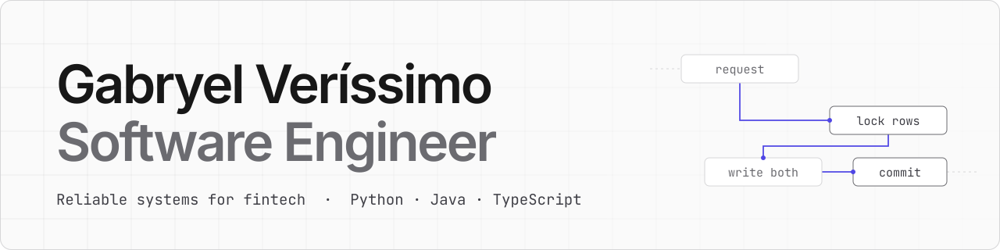

<a href="https://gabryelverissimo.dev">
  <picture>
    <source media="(prefers-color-scheme: dark)" srcset="assets/banner-dark.svg">
    
  </picture>
</a>

I build reliable systems for fintech: payments, ledgers and the services around them, in Python, Java and TypeScript. Everything below is tested and open source, and the three case studies run live.

**Open to graduate and junior software engineer roles in London from summer 2027.** 
[gabryelverissimo.dev](https://gabryelverissimo.dev) · [hello@gabryelverissimo.dev](mailto:hello@gabryelverissimo.dev) · [LinkedIn](https://www.linkedin.com/in/gabryel-ver%C3%ADssimo-b1b931261)

### Case studies

Written up like design docs: the problem, the hard parts, and links to the exact code and tests.

**[PayLedger](https://gabryelverissimo.dev/work/payledger)**: a double-entry payments API that stays correct when transfers race, requests are retried, and callers try wallets that aren't theirs. 
Python · FastAPI · PostgreSQL · [code](https://github.com/gabryelvs/payledger) · [live API](https://payledger-gv.vercel.app/docs)

**[Webhook Inspector](https://gabryelverissimo.dev/work/webhook-inspector)**: a public endpoint that captures any webhook sent to it and shows it live, and never tells the sender that something went wrong on its side. 
FastAPI · PostgreSQL · React · TypeScript · [code](https://github.com/gabryelvs/webhook-inspector) · [live app](https://webhook-inspector-gv.vercel.app)

**[Taskboard API](https://gabryelverissimo.dev/work/taskboard-api)**: a Trello-style API where two people can drag the same card at once, and a reused refresh token signs its owner out everywhere. 
Java 21 · Spring Boot · PostgreSQL · [code](https://github.com/gabryelvs/taskboard-api) · [live API](https://taskboard-api-h3yu.onrender.com/swagger-ui.html)

### More work

- [FX-Service](https://github.com/gabryelvs/fx-service): async currency-exchange API that keeps serving last-known rates when the upstream is down.
- [Webhook-Dispatcher](https://github.com/gabryelvs/webhook-dispatcher): reliable webhook delivery with a queue and worker, signed requests, retries with backoff, and dead-letter replay.
- [OWASP Security Lab](https://github.com/gabryelvs/owasp-security-lab): six OWASP Top 10 issues, each with a working exploit, a fix, and tests proving both.
- [SECTOR—9](https://github.com/gabryelvs/store-demo): animated demo storefront with an accessible, tested cart.

### Stack

Python · FastAPI · Java · Spring Boot · TypeScript · React · Next.js · PostgreSQL · Redis · Docker · GitHub Actions · pytest · Testcontainers

I work with AI-assisted development (Claude Code): I set the design, review every change, and don't ship what I can't explain or test.
